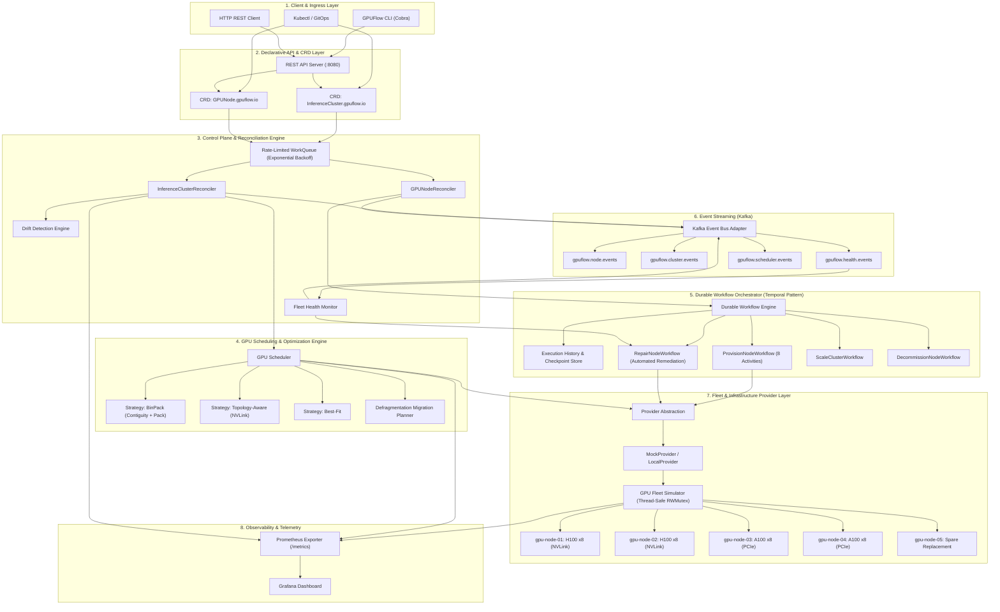
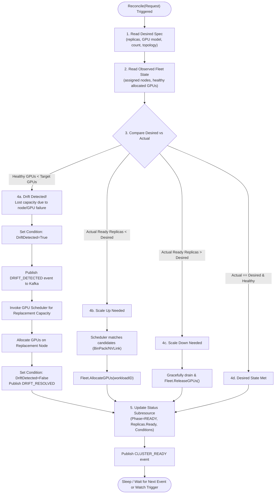
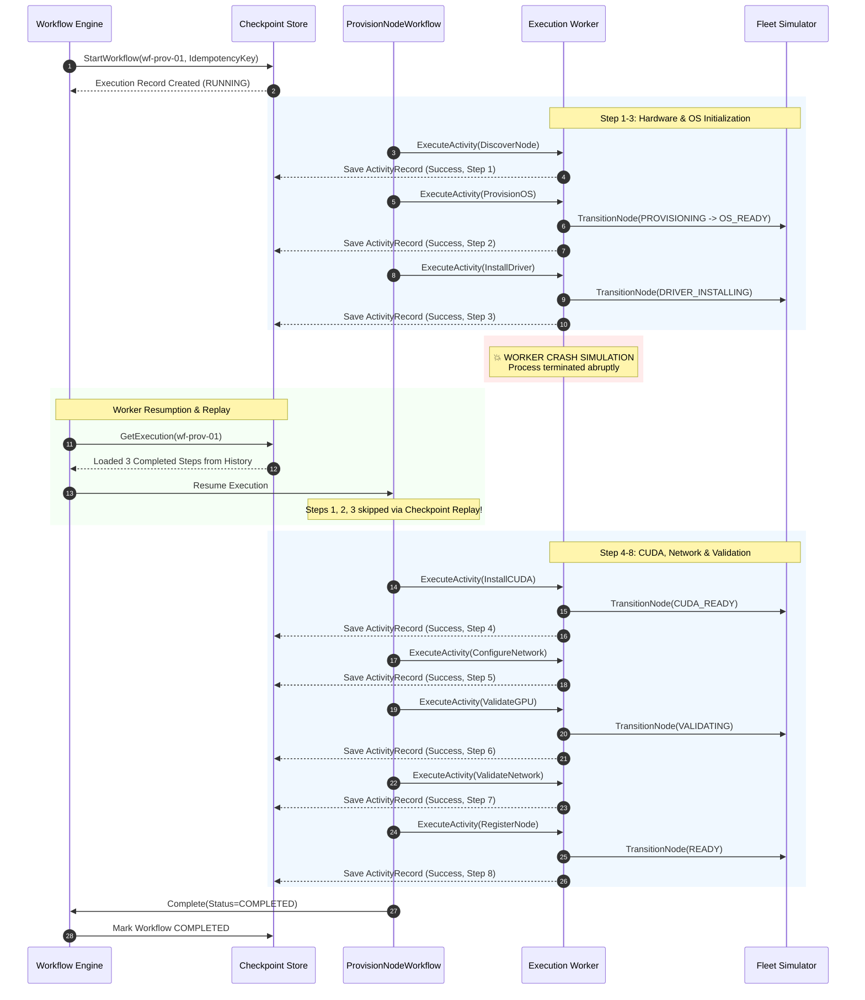
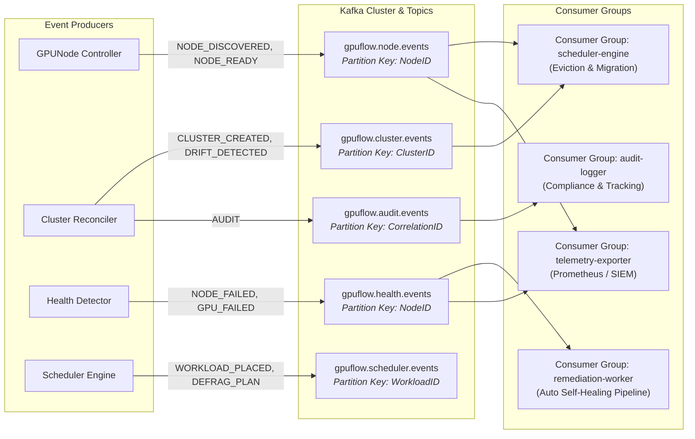
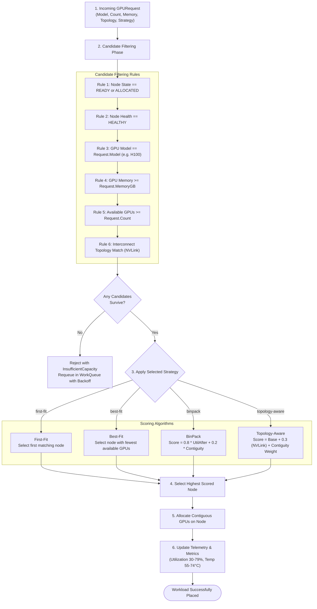
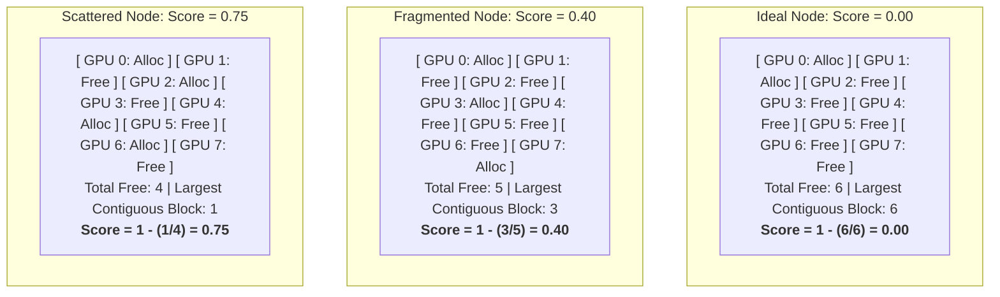
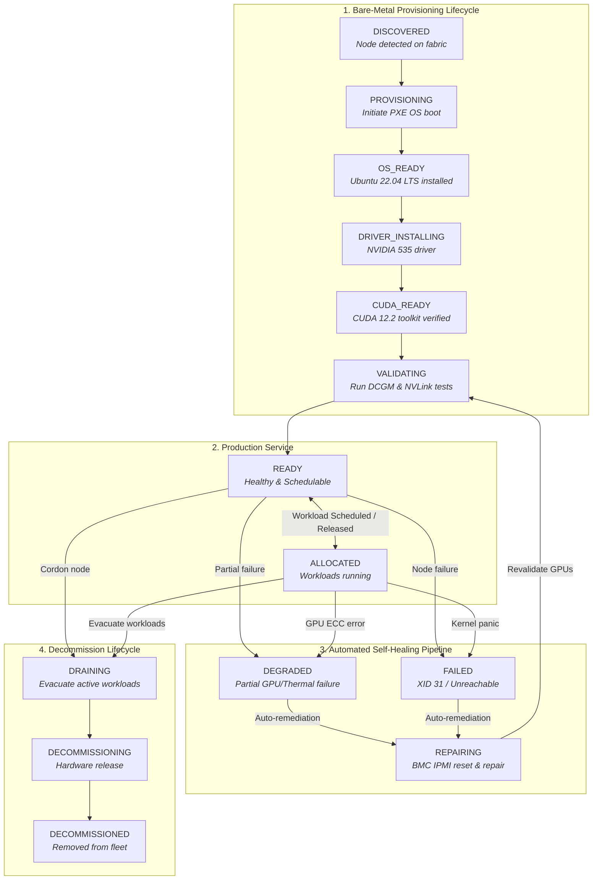
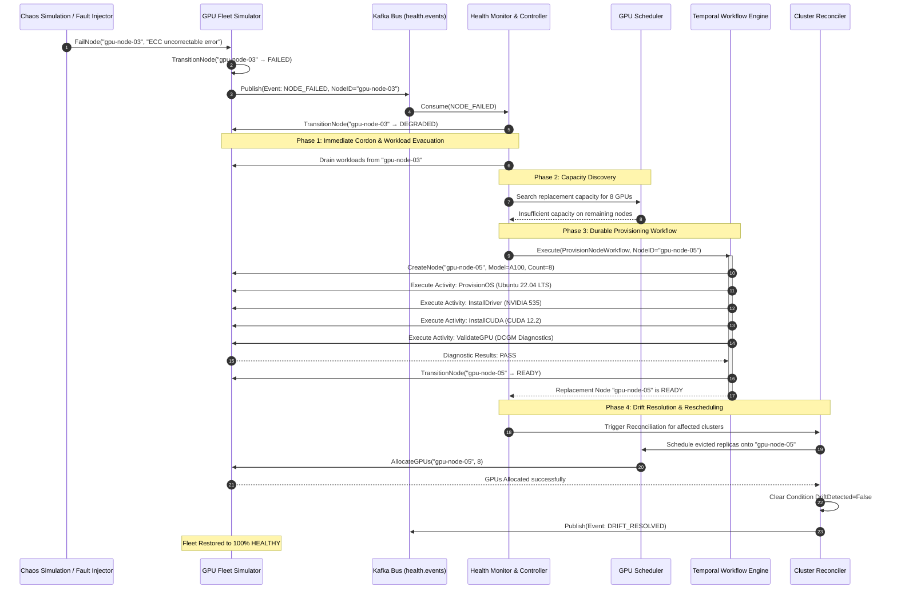

# GPUFlow — Kubernetes-Native GPU Fleet Control Plane

GPUFlow is a production-grade control plane for managing a simulated heterogeneous GPU inference fleet. It demonstrates the distributed systems engineering patterns required for infrastructure and control-plane platforms: Kubernetes controllers, Custom Resource Definitions (CRDs), level-triggered reconciliation loops, drift detection, GPU-aware scheduling, bin packing, capacity defragmentation, automated self-healing, durable workflow orchestration (Temporal pattern), event streaming (Kafka), and Prometheus observability.

> **Core Philosophy:** Desired state is declared declaratively by the user or client; GPUFlow continuously reconciles actual state toward desired state using event-driven watch mechanisms, level-triggered drift detection, and deterministic self-healing pipelines.

---

## Table of Contents

1. [Architecture & System Design](#1-architecture--system-design)
2. [Quick Start & Local Development](#2-quick-start--local-development)
3. [Deterministic Demo Walkthrough](#3-deterministic-demo-walkthrough)
4. [Custom Resource Definitions (CRDs)](#4-custom-resource-definitions-crds)
5. [Reconciliation Engine & Drift Detection](#5-reconciliation-engine--drift-detection)
6. [Durable Workflows (Temporal Pattern)](#6-durable-workflows-temporal-pattern)
7. [Event-Driven Streaming (Kafka)](#7-event-driven-streaming-kafka)
8. [GPU Scheduling & Defragmentation](#8-gpu-scheduling--defragmentation)
9. [Node Finite State Machine](#9-node-finite-state-machine)
10. [Automated Failure Recovery & Self-Healing](#10-automated-failure-recovery--self-healing)
11. [REST API Reference](#11-rest-api-reference)
12. [CLI Reference](#12-cli-reference)
13. [Observability, Metrics & Grafana Dashboard](#13-observability-metrics--grafana-dashboard)
14. [Testing & Quality Verification](#14-testing--quality-verification)
15. [Repository Structure](#15-repository-structure)

---

## 1. Architecture & System Design



---

## 2. Quick Start & Local Development

Designed specifically to run comfortably on a standard laptop (e.g. Windows with WSL2/Ubuntu, macOS, or Linux, requiring only 8–12 GB RAM) with **no physical NVIDIA GPU required**:

```bash
# 1. Build binary
make build

# 2. Run all 57 tests across 9 packages with 0 cached results
make test

# 3. Run the deterministic end-to-end demo
make demo

# 4. Start the control plane and API server (:8080)
make serve
```

### Resource Profiles:

| Profile | Components Active | Memory Footprint | Description |
| :--- | :--- | :--- | :--- |
| `minimal` | GPUFlow + Fleet Simulator | ~120 MB | Local unit testing and CLI development |
| `events` | + Kafka Event Streaming | ~500 MB | Event-driven pub/sub integration |
| `full` | + Workflows + Prometheus + Grafana | ~1.5 GB | Full production control-plane stack |

---

## 3. Deterministic Demo Walkthrough

Run `make demo` or `go run ./cmd/gpuflow demo` to experience the complete control-plane lifecycle:

```text
╔══════════════════════════════════════╗
║        GPUFlow Control Plane         ║
║            DEMO MODE                 ║
╚══════════════════════════════════════╝

[1/8] Creating simulated fleet...
      Nodes: 4 | GPUs: 32 | H100: 16 | A100: 16

[2/8] Initializing GPU scheduler...
      Strategies: first-fit, best-fit, binpack, topology-aware

[3/8] Creating inference cluster 'llama-cluster'...
      Replica 0 → gpu-node-01 (8 GPUs)
      Replica 1 → gpu-node-02 (8 GPUs)

[4/8] Cluster status:

      Cluster: llama-cluster
      ────────────────────────────────────────
      Desired Replicas    2
      Ready Replicas      2
      GPUs Allocated      16
      Status              READY

[5/8] Fleet utilization:
      Total GPUs       32
      Allocated        16
      Available        16
      Utilization      50%

[6/8] Creating fragmented allocation pattern...
      Fragmentation Score: 0.00 (scattered capacity detected)

[7/8] Running defragmentation planner...
      Moves needed:       1
      Frag before:        0.00
      Frag after (est.):  0.00
      Nodes freed:        1

[8/8] Simulating node failure and self-healing...

      [EVENT] NODE_FAILED gpu-node-03
      [HEALTH] Node marked DEGRADED
      [REMEDIATION] Draining workloads...
      [SCHEDULER] Searching replacement capacity...
      [TEMPORAL] Starting RepairNodeWorkflow
      [PROVISION] gpu-node-05
      [VALIDATION] GPU ........ PASS
      [VALIDATION] CUDA ....... PASS
      [VALIDATION] Network .... PASS
      [REMEDIATION] Replacement READY
      [RESCHEDULE] Workloads migrated
      [STATUS] Fleet HEALTHY (4/5 nodes healthy)

════════════════════════════════════════
  Demo complete!
════════════════════════════════════════
```

---

## 4. Custom Resource Definitions (CRDs)

GPUFlow defines Kubernetes-native declarative schemas installable into any cluster via `kubectl apply -f deploy/crds/` or Helm:

### `InferenceCluster` (`deploy/crds/gpuflow.io_inferenceclusters.yaml`)

```yaml
apiVersion: gpuflow.io/v1
kind: InferenceCluster
metadata:
  name: llama-cluster
spec:
  replicas: 2
  model:
    name: llama-70b
  runtime:
    name: vllm
  resources:
    gpu:
      model: H100
      count: 8
      memoryGB: 80
  scheduling:
    topology: NVLINK
    strategy: binpack
  availability:
    minHealthy: 1
status:
  phase: READY
  replicas:
    desired: 2
    ready: 2
    failed: 0
  allocatedGPUs: 16
  assignedNodes:
    - gpu-node-01
    - gpu-node-02
  conditions:
    - type: Ready
      status: "True"
      lastTransitionTime: "2026-09-29T23:30:00Z"
      reason: "Ready"
      message: "All replicas healthy and running"
```

### `GPUNode` (`deploy/crds/gpuflow.io_gpunodes.yaml`)

```yaml
apiVersion: gpuflow.io/v1
kind: GPUNode
metadata:
  name: gpu-node-01
spec:
  provider: local
  gpu:
    model: H100
    count: 8
    memoryGB: 80
  topology:
    type: NVLINK
status:
  phase: READY
  health: HEALTHY
  allocatedGPUs: 8
  availableGPUs: 0
```

---

## 5. Reconciliation Engine & Drift Detection

The reconciler enforces desired state through an asynchronous, rate-limited workqueue with exponential backoff:



---

## 6. Durable Workflows (Temporal Pattern)

Bare-metal hardware provisioning requires long-running, multi-stage pipelines. GPUFlow implements checkpointing and replay so that worker crashes resume seamlessly without repeating completed steps:



---

## 7. Event-Driven Streaming (Kafka)



---

## 8. GPU Scheduling & Defragmentation

### Decision Pipeline:



### Fragmentation Scoring Model:

$$\text{nodeFragScore} = 1.0 - \frac{\text{largestContiguousFreeBlock}}{\text{totalFreeGPUs}}$$

$$\text{fleetFragmentationScore} = \frac{\sum (\text{nodeFragScore}_i \times \text{freeGPUs}_i)}{\sum \text{freeGPUs}_i}$$



---

## 9. Node Finite State Machine



### State Transition Validation Matrix:

| Current State (`From`) | Legal Next States (`To`) | Trigger / Workflow |
| :--- | :--- | :--- |
| `""` (unregistered) | `DISCOVERED` | Initial node detection |
| `DISCOVERED` | `PROVISIONING`, `FAILED` | `ProvisionNodeWorkflow` Step 1 |
| `PROVISIONING` | `OS_READY`, `FAILED` | PXE OS boot completes |
| `OS_READY` | `DRIVER_INSTALLING`, `FAILED` | Kernel driver install starts |
| `DRIVER_INSTALLING` | `CUDA_READY`, `FAILED` | NVIDIA driver compile & load |
| `CUDA_READY` | `VALIDATING`, `FAILED` | CUDA toolkit verification |
| `VALIDATING` | `READY`, `FAILED` | DCGM diagnostic + NVLink test |
| `READY` | `ALLOCATED`, `DRAINING`, `DEGRADED`, `FAILED` | Workload placement or error |
| `ALLOCATED` | `READY`, `DRAINING`, `DEGRADED`, `FAILED` | Workload release or failure |
| `DRAINING` | `READY`, `DECOMMISSIONING`, `FAILED` | Workloads evicted |
| `DEGRADED` | `REPAIRING`, `DRAINING`, `FAILED` | Health detector trigger |
| `FAILED` | `REPAIRING`, `DECOMMISSIONING` | Automated remediation / removal |
| `REPAIRING` | `VALIDATING`, `FAILED` | `RepairNodeWorkflow` BMC reset |
| `DECOMMISSIONING` | `DECOMMISSIONED`, `FAILED` | Hardware release |
| `DECOMMISSIONED` | *(Terminal)* | Removed from fleet |

---

## 10. Automated Failure Recovery & Self-Healing



---

## 11. REST API Reference

| Method | Endpoint | Description |
| :--- | :--- | :--- |
| `GET` | `/metrics` | Prometheus metrics text format |
| `GET` | `/api/v1/clusters` | List all inference clusters |
| `POST` | `/api/v1/clusters` | Create and reconcile an inference cluster |
| `GET` | `/api/v1/clusters/{name}` | Get cluster status, replica count, and conditions |
| `POST` | `/api/v1/clusters/{name}/scale` | Dynamically scale cluster replicas (`{"replicas": N}`) |
| `DELETE` | `/api/v1/clusters/{name}` | Delete cluster and release allocated GPUs |
| `GET` | `/api/v1/nodes` | List all GPU nodes |
| `GET` | `/api/v1/nodes/{id}` | Get node status, state transitions, and per-GPU telemetry |
| `POST` | `/api/v1/nodes/{id}/fail` | Inject failure on node (triggers self-healing) |
| `POST` | `/api/v1/nodes/{id}/drain` | Cordon and drain node workloads |
| `GET` | `/api/v1/scheduler/capacity` | Capacity report by GPU model and node |
| `GET` | `/api/v1/scheduler/fragmentation` | Fleet and node-level fragmentation scores |
| `POST` | `/api/v1/optimization/plan` | Generate defragmentation migration plan |
| `POST` | `/api/v1/optimization/apply` | Apply defragmentation migrations |
| `GET` | `/api/v1/health` | Health check endpoint |
| `GET` | `/api/v1/health/issues` | Active node and GPU health issues |
| `GET` | `/api/v1/fleet/stats` | Summary statistics of fleet |

---

## 12. CLI Reference

```bash
# Cluster operations
gpuflow cluster create examples/llama.yaml
gpuflow cluster list
gpuflow cluster get llama-cluster
gpuflow cluster scale llama-cluster --replicas 4
gpuflow cluster delete llama-cluster

# Node operations
gpuflow node list
gpuflow node get gpu-node-01
gpuflow node drain gpu-node-01
gpuflow node fail gpu-node-01

# Scheduler and optimization
gpuflow scheduler capacity
gpuflow scheduler fragmentation
gpuflow optimize plan
gpuflow optimize apply

# Chaos failure simulation
gpuflow chaos node-failure gpu-node-03
gpuflow chaos gpu-failure gpu-node-02:gpu-04
gpuflow chaos network-failure gpu-node-01
gpuflow chaos driver-failure gpu-node-04
```

---

## 13. Observability, Metrics & Grafana Dashboard

Prometheus metrics exposed on `/metrics`:
- `gpuflow_gpu_utilization`: Per-node, per-GPU utilization percentage gauge
- `gpuflow_gpu_allocated`: Active allocated GPU count
- `gpuflow_gpu_free`: Free schedulable GPU count
- `gpuflow_node_health`: Health status gauge (1 for active status)
- `gpuflow_node_state`: Lifecycle state gauge
- `gpuflow_scheduler_placement_total`: Counter of placement requests
- `gpuflow_scheduler_placement_failures`: Counter of placement failures
- `gpuflow_fragmentation_score`: Fleet capacity fragmentation score (0.00 to 1.00)
- `gpuflow_reconciliation_total`: Counter of reconciler invocations
- `gpuflow_reconciliation_errors`: Counter of reconciliation failures
- `gpuflow_workflow_duration`: Execution duration gauge for workflows
- `gpuflow_repair_total`: Counter of automated node repairs

Pre-built Grafana Dashboard JSON available in [`deploy/grafana/dashboard.json`](file:///c:/Users/saile/Desktop/GPUFlow/deploy/grafana/dashboard.json).

---

## 14. Testing & Quality Verification

Run the entire non-cached test suite:

```bash
go test -count=1 ./...
```

```text
ok  	github.com/gpuflow/gpuflow/apiserver	0.991s
ok  	github.com/gpuflow/gpuflow/controllers	0.632s
ok  	github.com/gpuflow/gpuflow/events	0.650s
ok  	github.com/gpuflow/gpuflow/health	0.649s
ok  	github.com/gpuflow/gpuflow/pkg/metrics	0.963s
ok  	github.com/gpuflow/gpuflow/providers	0.625s
ok  	github.com/gpuflow/gpuflow/scheduler	0.643s
ok  	github.com/gpuflow/gpuflow/simulator	0.647s
ok  	github.com/gpuflow/gpuflow/workflows	0.661s
```

**Total: 57 tests passing across 9 packages with 0 failures.**

---

## 15. Repository Structure

```
GPUFlow/
├── apiserver/               # REST API server & HTTP handlers
├── cmd/gpuflow/             # CLI application & demo runner
├── controllers/             # Kubernetes reconciliation engine & controllers
├── deploy/
│   ├── crds/                # CustomResourceDefinition YAML manifests
│   ├── grafana/             # Grafana dashboard JSON
│   └── helm/                # Helm deployment charts
├── docs/                    # Architecture & engineering design specs
│   ├── architecture.md      # Detailed system architecture
│   ├── failure-recovery.md  # Self-healing pipeline spec
│   ├── local-development.md # Local development setup guide
│   ├── scheduling.md        # GPU-aware scheduling algorithms
│   └── state-machine.md     # Node lifecycle state machine
├── events/                  # Event streaming (In-Memory + Kafka)
├── examples/                # Cluster specification manifests (YAML/JSON)
├── health/                  # Fleet health monitoring & detector
├── pkg/
│   ├── apis/gpuflow/v1/     # Kubernetes Go API types & Conditions
│   ├── config/              # Configuration & profiles
│   ├── logger/              # Structured JSON logging
│   ├── metrics/             # Prometheus metrics registry
│   └── types/               # Core domain models
├── providers/               # Infrastructure provider abstraction
├── scheduler/               # GPU-aware scheduler & defrag planner
├── simulator/               # GPU fleet hardware & failure simulator
└── workflows/               # Durable Temporal-style workflow orchestration
```
