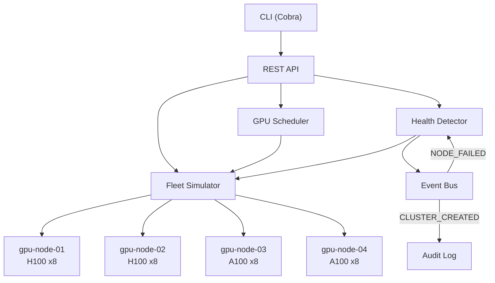
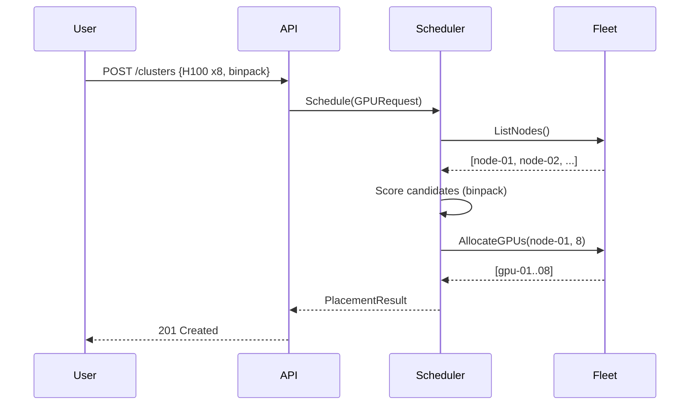
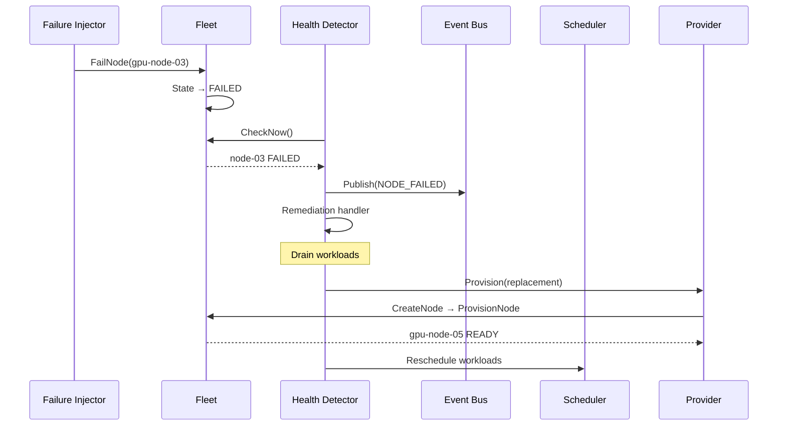
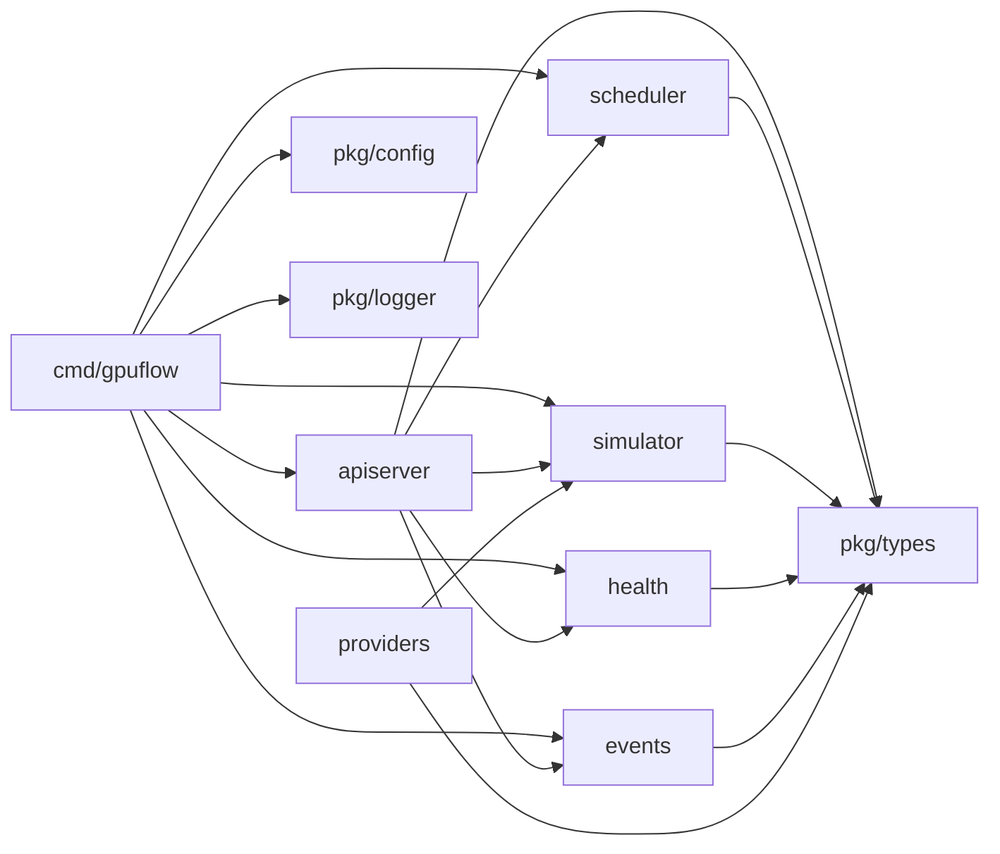

# GPUFlow Architecture

## Overview

GPUFlow is a control plane that manages GPU inference fleet resources using a declarative, reconciliation-based model. Users declare desired state; GPUFlow continuously drives actual state toward desired state.

## Core Design Principles

1. **Declarative Over Imperative**: Users specify *what* they want, not *how* to get there
2. **Reconciliation**: Controllers continuously compare desired vs actual state
3. **Idempotency**: All operations are safe to retry
4. **Event-Driven**: Components react to events, not polling
5. **Provider Abstraction**: Control plane is decoupled from infrastructure specifics

## Component Architecture

## Data Flow: Workload Placement

## Data Flow: Self-Healing

## Package Dependencies

## Thread Safety

All simulator operations use `sync.RWMutex`:
- **Writes** (create, transition, allocate, fail): exclusive lock
- **Reads** (get, list, stats): shared lock
- **GetNode/ListNodes**: return deep copies to prevent races

## Configuration Profiles

| Profile | Components | Use Case |
|---------|------------|----------|
| `minimal` | GPUFlow + Simulator + PostgreSQL | Day-to-day development |
| `events` | + Kafka | Testing event-driven flows |
| `full` | + Temporal + Prometheus + Grafana | Full demo/integration tests |
