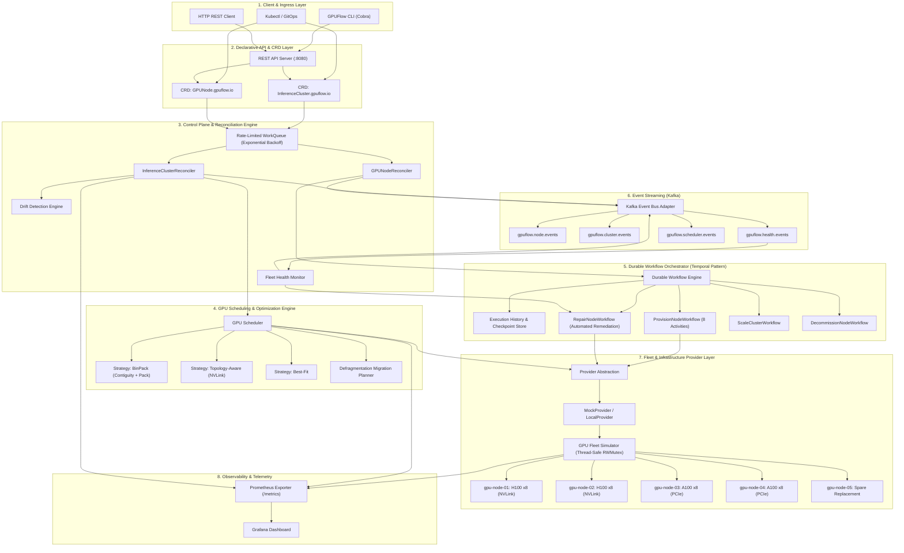
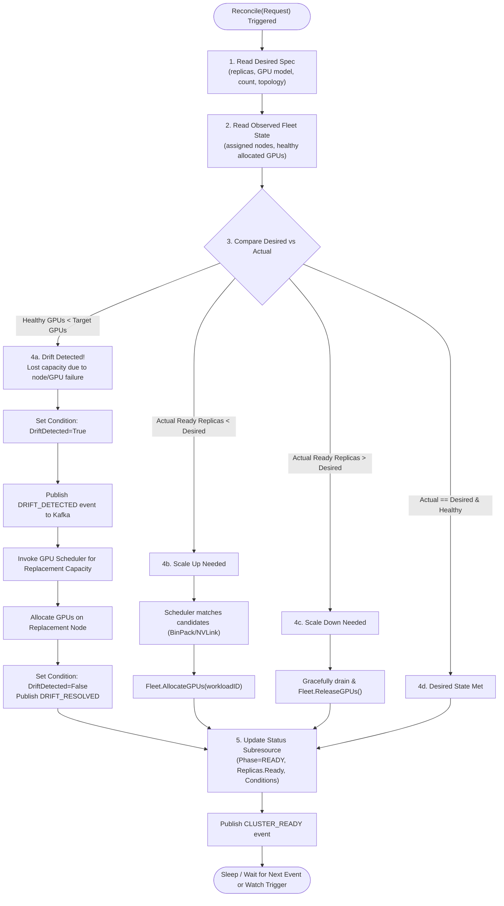
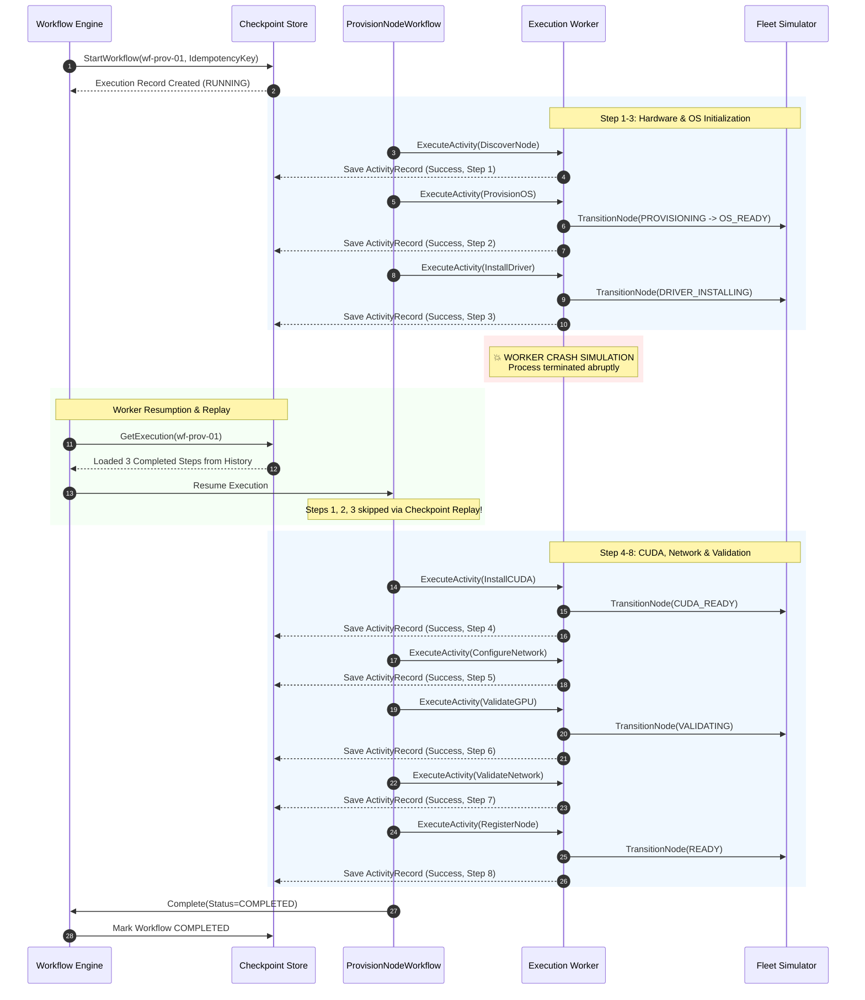
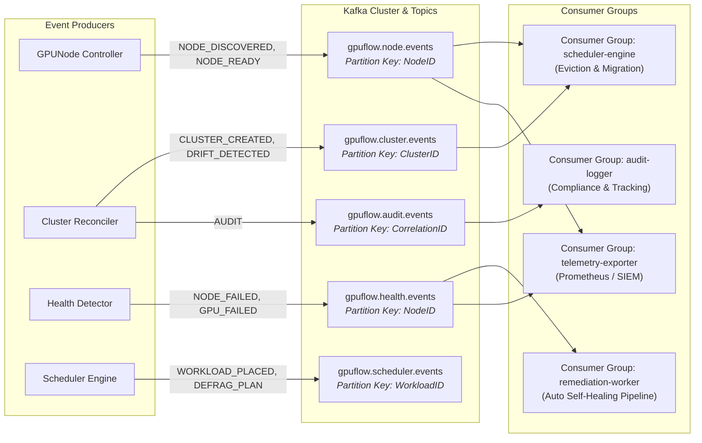
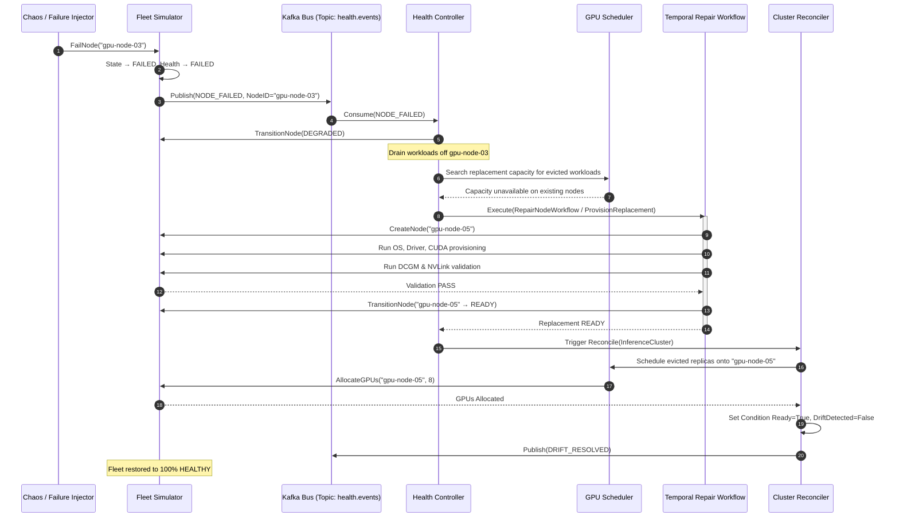
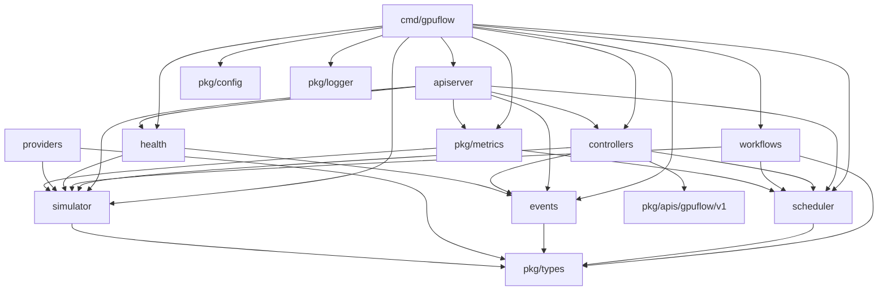

# GPUFlow Architecture & System Design

## 1. System Overview

GPUFlow is a Kubernetes-native control plane for managing heterogeneous GPU inference fleets. It incorporates declarative Custom Resource Definitions (CRDs), level-triggered reconciliation loops, drift detection, GPU-aware scheduling, capacity defragmentation, durable workflow orchestration, event streaming, and Prometheus observability.

---

## 2. End-to-End System Layer Architecture

---

## 3. Declarative Reconciliation & Drift Detection Flow

The Kubernetes controller follows an event-driven reconciliation pattern with rate-limited exponential backoffs. It continuously checks for hardware degradation or state drift.

---

## 4. Durable Temporal-Style Workflow Architecture

GPU provisioning requires long-running bare-metal operations (OS boot, firmware flashing, driver compile, CUDA validation). GPUFlow implements checkpointing and replay so that worker crashes resume seamlessly:

---

## 5. Event-Driven Kafka Streaming Architecture

---

## 6. End-to-End Automated Self-Healing Pipeline

---

## 7. Package Dependencies & Decoupling

