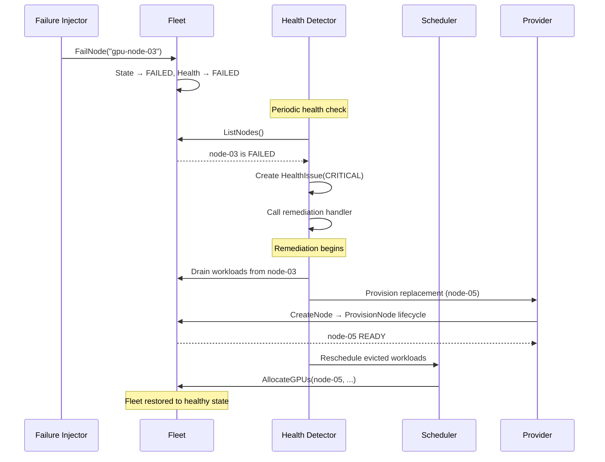

# Failure Recovery

## Failure Types

| Type | Severity | Auto-Recovery |
|------|----------|---------------|
| `GPU_FAILURE` | Warning/Critical | ✅ Degraded → Repair |
| `DRIVER_FAILURE` | Critical | ✅ Fail all GPUs → Repair |
| `NETWORK_FAILURE` | Critical | ✅ Node failure → Replace |
| `TEMPERATURE_HIGH` | Warning | ✅ Throttle → Monitor |
| `NODE_UNREACHABLE` | Critical | ✅ Replace node |

## Self-Healing Flow



## Recovery Steps

1. **Detection**: Health detector identifies FAILED/DEGRADED nodes
2. **Issue Creation**: HealthIssue generated with type and severity
3. **Remediation Trigger**: Remediation handler invoked
4. **Workload Drain**: Active workloads evacuated from failed node
5. **Replacement Provisioning**: New node created and provisioned through state machine
6. **Validation**: GPU, CUDA, and network validation on replacement
7. **Rescheduling**: Evicted workloads placed on new or existing nodes
8. **Issue Cleared**: Health issue removed after recovery

## Chaos Commands

```bash
gpuflow chaos node-failure gpu-node-03     # Complete node failure
gpuflow chaos gpu-failure gpu-node-02:gpu-04  # Single GPU failure (planned)
gpuflow chaos network-failure gpu-node-01   # Network partition (planned)
gpuflow chaos driver-failure gpu-node-04    # Driver crash (planned)
```

## Idempotency

All recovery operations are idempotent:
- `FailNode` on an already-failed node is safe
- `RecoverNode` can be called multiple times
- Provision with same node ID returns existing node
- Deprovision of non-existent node returns success

## Retry Behavior

Failed provisioning steps are retried with the following approach:
- Each step in the state machine can be independently retried
- If a step exceeds retry limits, the node transitions to FAILED
- Resources allocated during partial provisioning are released on rollback
- Attempt number, error, and timestamp are recorded in state transitions
