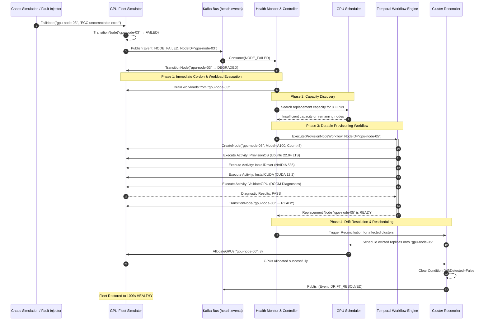
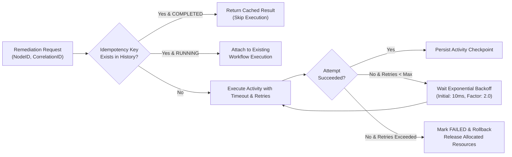

# Failure Recovery & Automated Remediation

## 1. Overview

In large GPU clusters, hardware degradation is a daily occurrence: NVLink errors, thermal throttling, uncorrectable double-bit ECC errors, and PCIe bus resets. GPUFlow handles failures autonomously through level-triggered health detection, event streaming, and durable self-healing workflows without human intervention.

---

## 2. Failure Severity & Auto-Recovery Matrix

| Failure Type | Source / Metric | Severity | Automated Remediation Flow |
| :--- | :--- | :--- | :--- |
| `GPU_FAILURE` | DCGM fatal ECC error | High | Degrade node → Drain affected workload → BMC reset GPU → Revalidate |
| `DRIVER_FAILURE` | NVIDIA XID 31 / 79 | Critical | Mark FAILED → Drain node → Reload kernel module / Power cycle |
| `TEMPERATURE_HIGH` | GPU Temp > 88°C | Warning | Throttle utilization → Monitor → Degrade if sustained |
| `NETWORK_FAILURE` | RoCE / InfiniBand drop | Critical | Cordon node → Evacuate replicas → Reschedule to spare |
| `NODE_UNREACHABLE` | Heartbeat timeout (>30s) | Critical | Evict workloads → Provision replacement node via Temporal |

---

## 3. End-to-End Self-Healing Flow Diagram

---

## 4. Idempotency & Retry Guarantees

Every step in the remediation pipeline is protected against duplicate execution:

