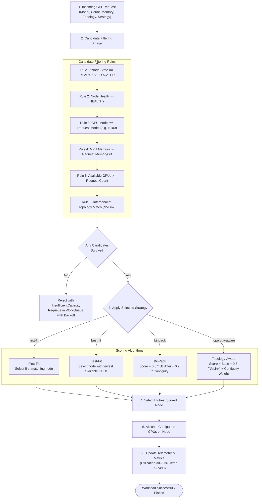
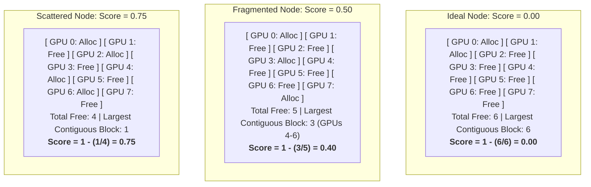
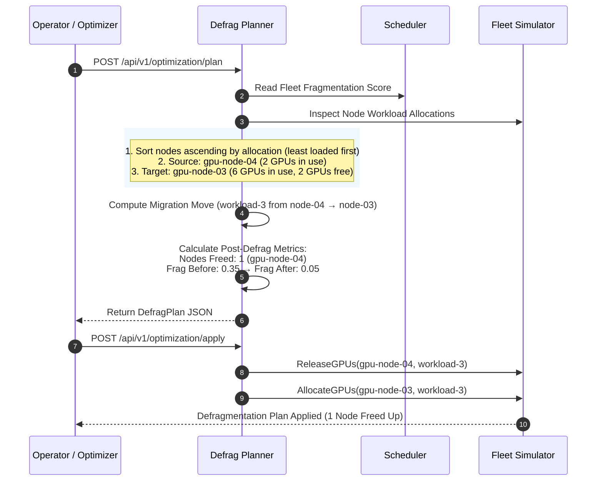

# GPU Scheduling & Capacity Defragmentation

## 1. Overview

GPUFlow features a specialized GPU scheduler designed for multi-GPU training and high-throughput inference (vLLM, TensorRT-LLM). It solves key challenges unique to GPU clusters:
- **Interconnect Topology**: NVLink vs PCIe bus bandwidth penalties.
- **Resource Granularity**: Multi-GPU co-location on same NUMA nodes.
- **Capacity Fragmentation**: Free GPUs scattered across nodes preventing multi-GPU allocations.

---

## 2. Scheduling Decision Pipeline

---

## 3. Fragmentation Analysis & Scoring

Fragmentation occurs when total free GPUs across the fleet are sufficient, but no single node has enough contiguous GPUs to satisfy a request (e.g., an 8-GPU NVLink llama-70b replica).

### Scoring Model:

$$\text{nodeFragScore} = 1.0 - \frac{\text{largestContiguousFreeBlock}}{\text{totalFreeGPUs}}$$

$$\text{fleetFragmentationScore} = \frac{\sum (\text{nodeFragScore}_i \times \text{freeGPUs}_i)}{\sum \text{freeGPUs}_i}$$

---

## 4. Defragmentation Migration Planner

The defragmentation engine analyzes active fleet allocations and calculates an optimal migration plan to consolidate fragmented nodes:

