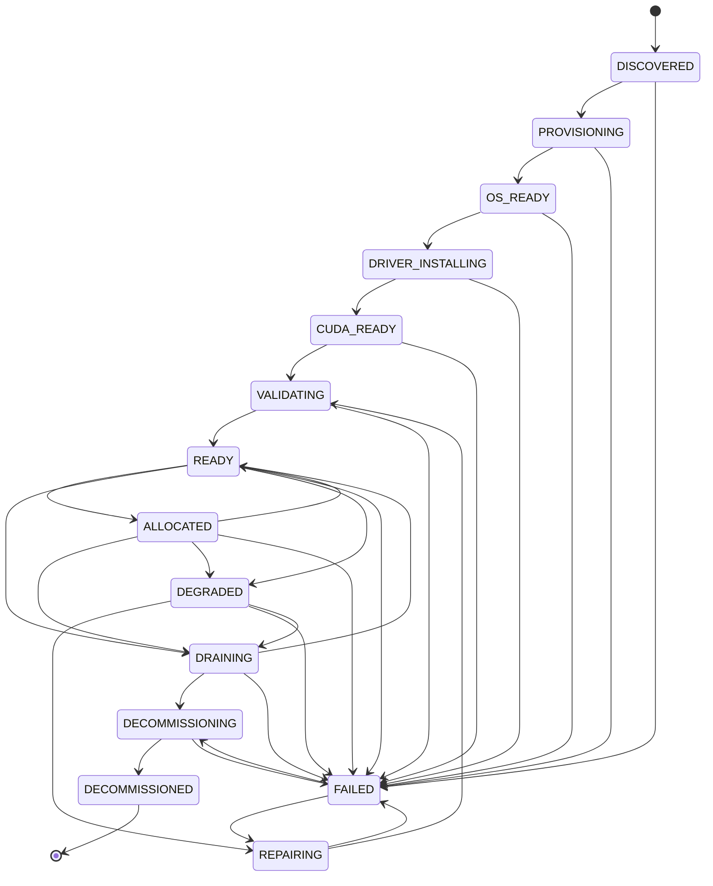

# Node State Machine

## States

| State | Description |
|-------|-------------|
| `DISCOVERED` | Node detected but not yet provisioned |
| `PROVISIONING` | OS installation in progress |
| `OS_READY` | Operating system installed |
| `DRIVER_INSTALLING` | GPU driver installation in progress |
| `CUDA_READY` | CUDA toolkit installed |
| `VALIDATING` | Running GPU, CUDA, and network validation |
| `READY` | Node available for workload scheduling |
| `ALLOCATED` | Node has active GPU allocations |
| `DRAINING` | Workloads being migrated off |
| `DEGRADED` | Partial failure (e.g., 1 GPU failed) |
| `FAILED` | Complete node failure |
| `REPAIRING` | Recovery in progress |
| `DECOMMISSIONING` | Node being removed from fleet |
| `DECOMMISSIONED` | Terminal state, node removed |

## Transition Diagram



## Transition Record

Every transition is recorded with:

```json
{
  "timestamp": "2024-01-15T10:30:00Z",
  "nodeId": "gpu-node-01",
  "previousState": "READY",
  "newState": "FAILED",
  "reason": "GPU temperature exceeded threshold",
  "correlationId": "corr-abc123"
}
```

## Provisioning Path (Happy Path)

```
DISCOVERED → PROVISIONING → OS_READY → DRIVER_INSTALLING → CUDA_READY → VALIDATING → READY
```

## Failure & Recovery Path

```
ANY_STATE → FAILED → REPAIRING → VALIDATING → READY
```

## Decommission Path

```
READY/ALLOCATED → DRAINING → DECOMMISSIONING → DECOMMISSIONED
```

## Implementation

State transitions are validated before execution. Invalid transitions (e.g., `DISCOVERED → READY`) are rejected with an error. The `validateTransition` function in `simulator/fleet.go` enforces the allowed transitions map.
